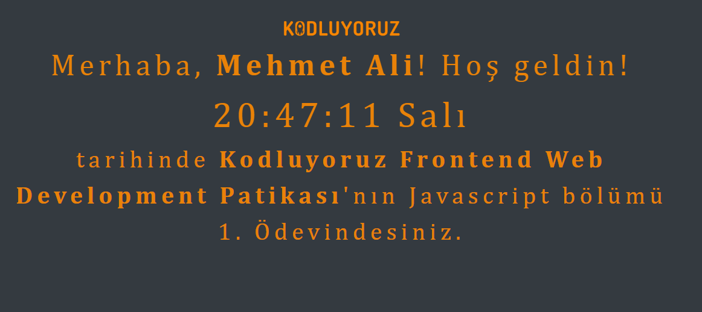

# Kullanıcan alınan isim bilgisinden sonra dijital saat uygulaması

Kullanıcan promt yolu ile almış olduğumuz kullanıcı bilgisini sayfada göstererek güncel saat dakika saniye ve gün bazında göstererek dijital saat yapıldı. JS icerisinde her 1 saniyede 1 çağırmak için fonksiyon yazıldı ve her saniye sayfanın otomatik yenilenmesi sağlandı

Çalışmanın görsel hali

